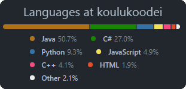

╓┤ Minä ├───▰▰▰  
║  
║ &nbsp; Hei olen Aki! :vulcan_salute:   
║ &nbsp; Kuulet minun usein sanovan;  
║ &nbsp; ”Itse kun tekee, niin saa mitä ansaitsee” tai    
║ &nbsp; ”Jos sen on ihminen tehnyt, niin sen voi ihminen korjata”.   
║   
║ &nbsp; Minun suurin vahvuuteni on ongelmien luova ratkaisu,   
║ &nbsp; ympäristöä ja käytössä olevia työkaluja hyödyntäen.   
║       
╟┤ Yhteys minuun ├─────────▰▰▰▰   
║   
╟─◈ [Mail](mailto:the.rytkonen@gmail.com)    
╟─◈ [LinkedIn](https://linkedin.com/in/rytkönen)  
╟─◈ [Facebook](https://www.facebook.com/aki.rytkonen)   
║   
║   
╟┤ Jotain esimerkkikoodeja ├───────────────────────▰▰▰▰▰   
║   
╟─◈ [Koulujuttuja :lock:](https://github.com/Dacroni/koulukoodei)   
║ &nbsp;&nbsp;└◈ [readme](./koulujuttuja.md)    
║   
║     
╙┤ Tekniikoita joihin olen edes hieman tutustunut ├──────────────────────────────────────────▰▰▰▰▰▰  

  
   
  
   
  
  
   
  
  
   
   
  
  
  
  
  
  
  
  

▰▰▰▰▰▰──────────────────────────────────────────────────────────────────▰▰▰▰▰▰  